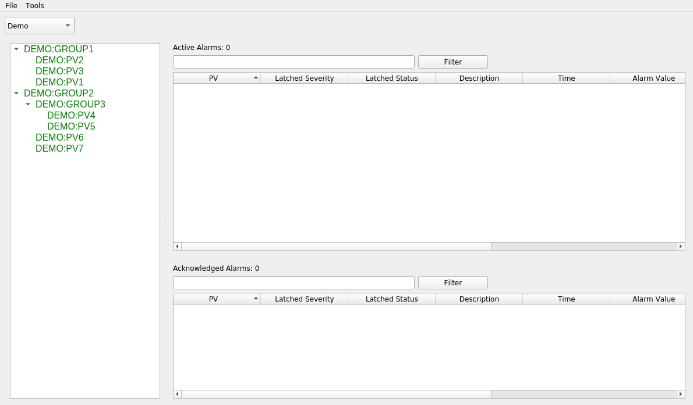
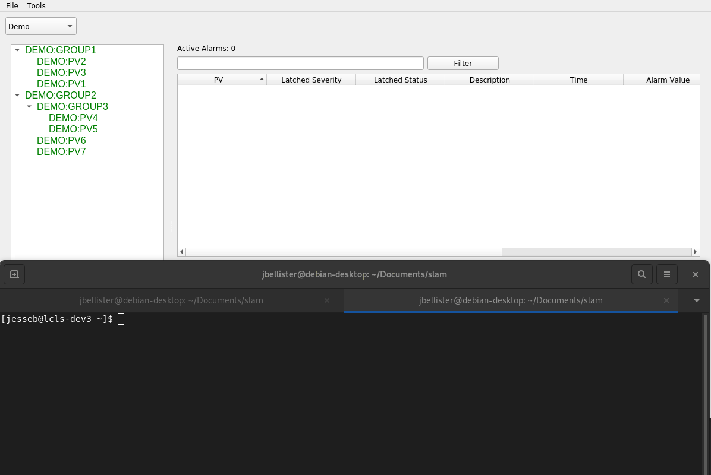

# Alarm Manager

Since the alarm server and logger are both built with [Phoebus](https://github.com/ControlSystemStudio/phoebus), many of the
interface details and actions described here will be familiar to anyone who has used the Phoebus alarm
interface in the past.

---
**NOTE**

This alarm manager interacts with [NALMS](https://github.com/slaclab/nalms) only, and does not directly communicate
using EPICS with any IOCs. Therefore all actions available from the interface are write-safe when it comes to EPICS -
nothing will write back to any PV.

---

## Starting the Alarm Manager

As this application is a frontend interface to NALMS, a running NALMS instance is 
required. The specific component which the alarm manager will be communicating with is [kafka](https://kafka.apache.org/).

Both the location of the kafka instance, and the alarm topics which should be monitored are required arguments
upon startup.

From a terminal window with the python environment that the alarm manager was installed into active, run the following command,
replacing the name of the topic and the location of kafka as appropriate:

`slam --topics Demo --bootstrap-servers localhost:9092`

It is possible for the interface to monitor multiple topics at once if passed a comma-separated list:

`slam --topics Demo,Accelerator,Cryoplant --bootstrap-servers localhost:9092`

In an ideal scenario, the main window will look something like this:

The panel to the left of the window is the tree view of all the alarms being monitored. It will match the alarm hierarchy
defined in the xml config file above. To the right are two tables, the top one will display PVs which are in an active
alarm state, the bottom one will display acknowledged alarms (more on this later). 

## Active Alarms

In order to make this display a little more interesting, let's run a few caput commands to get PVs into an 
alarm state:

When a PV moves into an alarm state, it is reflected both in the change to the alarm tree, as well as the addition to
the active alarm table. Note that when a PV returns to a normal alarm status, the corresponding entry is removed
from the alarm table. This behavior is caused by the `latched` option. If `latched` is set to true, then the alarm
will remain in the table until someone manually acknowledges it (see the next section). The purpose would be to set
the latched status to true for any alarm which requires someone to look into why it happened, even if it returns
to normal on its own.

## Acknowledging and Bypassing Alarms

When a PV or top level group has gone into an alarm status, right-clicking on it will bring up a menu for taking additional
actions on the alarm.

The first of these actions is to acknowledge it. This basically means that someone is aware that the PV is now in an
alarm state, and action is being taken to correct that. Upon clicking on acknowledge, note that the alarm status
changes, and it is moved to the bottom table for acknowledged alarms:

As can be seen in the example, multiple alarms in a group can be acknowledged at once by acknowledging thier top-level
summary alarm. And if an acknowledgment is done by accident, it can be reverted with the same right-click menu and
choosing unacknowledge.

The other important action there is to enable or disable an alarm. Disabling an alarm will stop any future updates
to the underlying PV(s) from being displayed until it is re-enabled. One example where this is useful is if a 
component is undergoing planned maintenance and so there is no need for any alarms to trigger until the maintenance
has been completed.

Finally the remaining two options are to copy the name of the PV to the clipboard, and to draw a plot of the PV in 
a separate window. This plot is rendered using PyDM.
